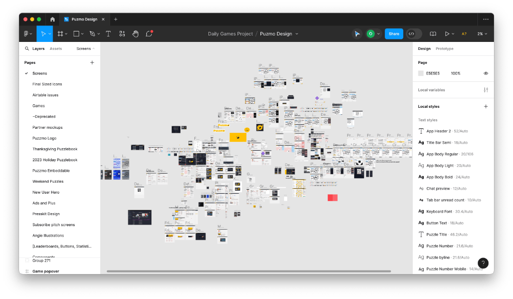
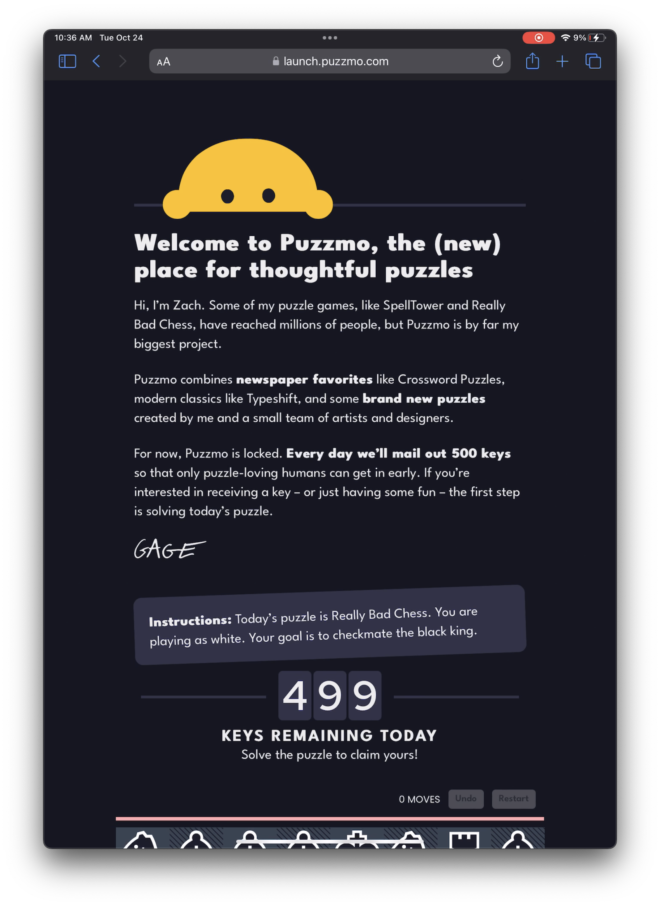
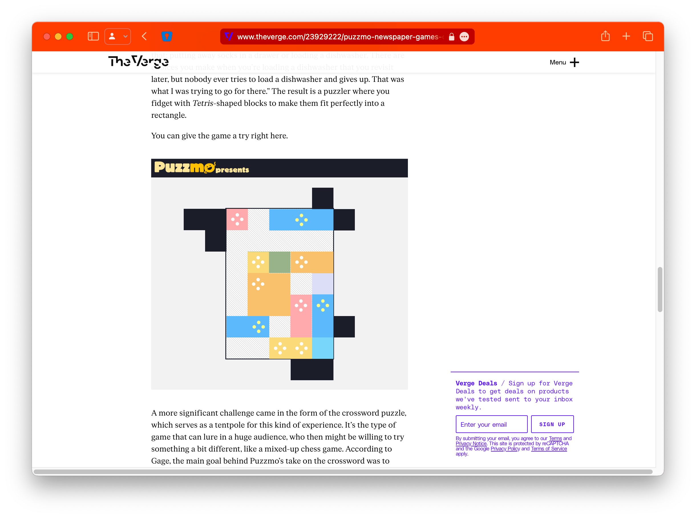
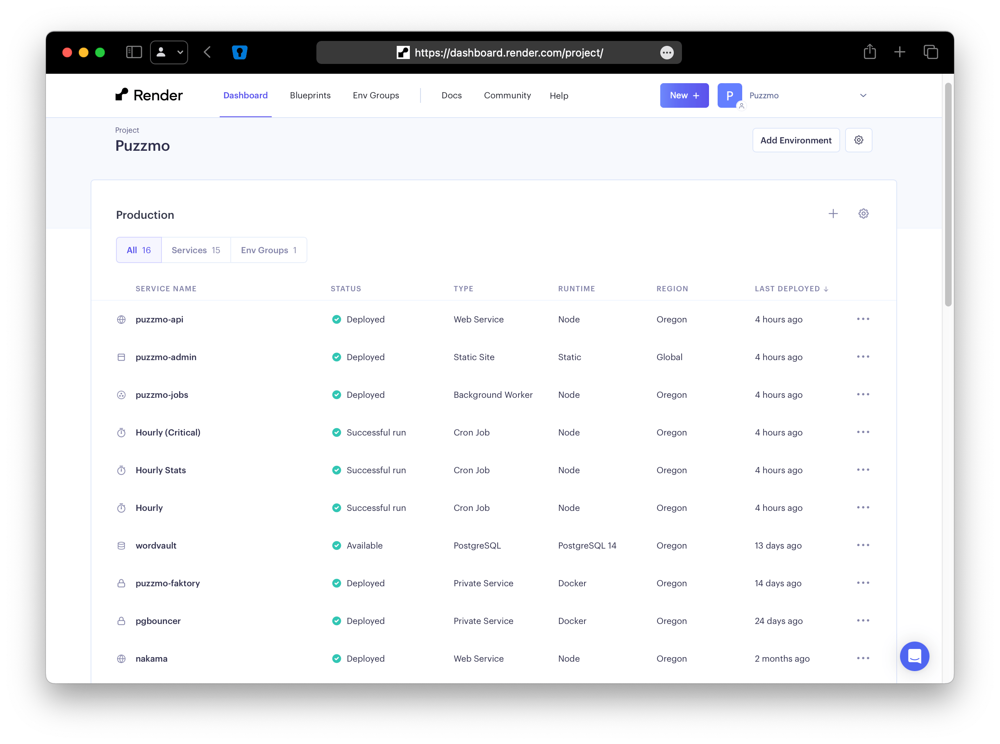
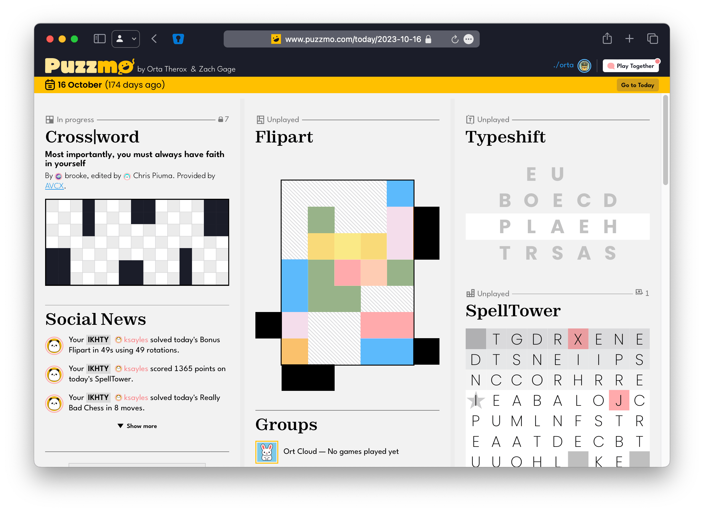
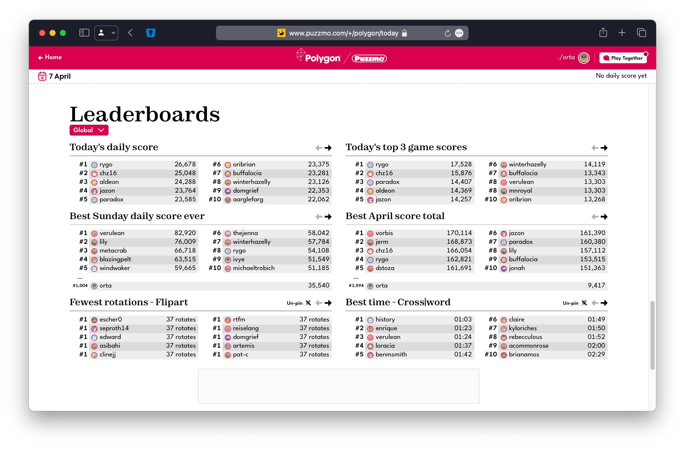
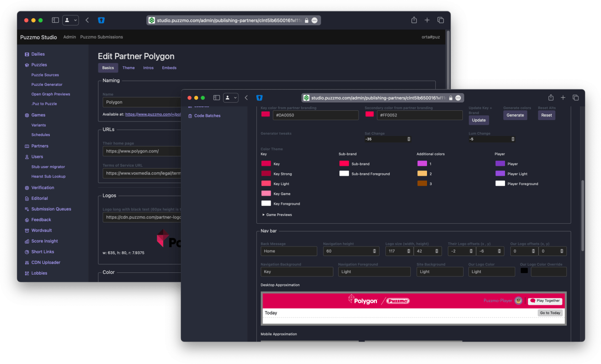
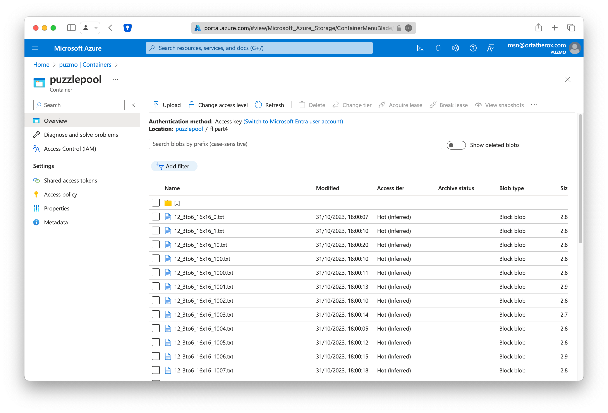
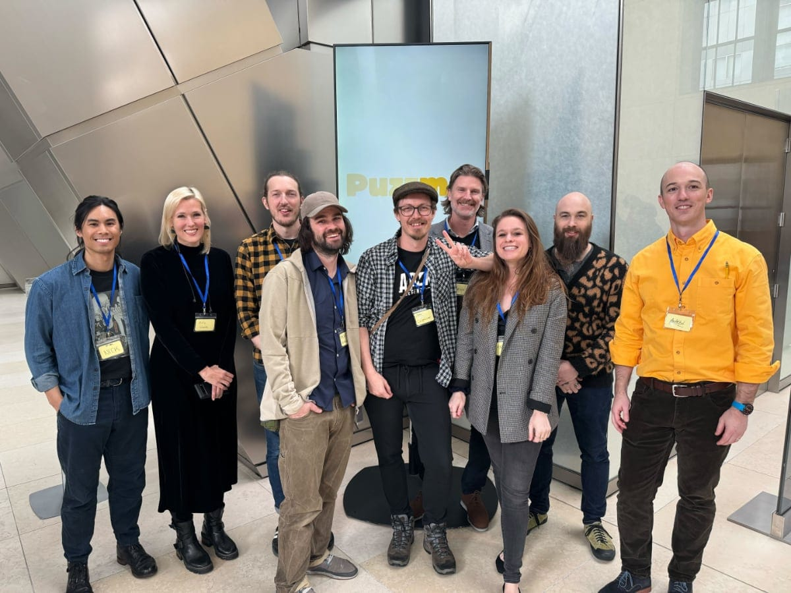

+++
title = 'Puzzmo v1 tech deep-dive'
date = 2024-04-15T12:56:32Z
authors = ["orta"]
tags = ["tech", "launch"]
theme = "outlook-hayesy-beta"
draft = true
+++

This post is trying to do a lot. There are a few ways which we split Puzzmo internally - both technically and culturally. For this post, I'm mainly going to be concentrating on "Puzzmo" the system, e.g. the bits which power game features like the website, leaderboards, scoring systems, groups, servers and that sort of thing. Internally, we generally call it either "App" _(the public facing website)_ or "API" _(the servers powering the website)_ stuff.

This conceptual framing kinda defines itself as not being "games" stuff like _"We changed Wordbind to use two words"_ or _"We used Redux Toolkit"_, the hows and whys for those sorts of things are not really my story to tell, and I have enough on my plate trying to keep on top of the technical architecture for Puzzmo.

I'd like to try and give myself a bit of a look back at what we shipped back in November 2023 when Puzzmo first became publicly available. As I finish this writeup (started in December) in April, we're starting to look at shipping some of our first major systemic changes and it'd be good to have something which reminds us where we were.

### What did it take to ship Puzzmo?

We started off with a small jpg [and a general plan](https://www.youtube.com/watch?v=68TGvXlSSVY), and turned it into that figma above over the course of two years. We were in a bit of a strange position as a mix of "games" and "app" culturally, as well as being a tech startup I guess. This meant we could kind of pick-and-choose ideas from all of those cultures.

I don't think we did a good job of either being a "lean product" nor a "minimum viable product", but we had a pretty strong idea of what we wanted to build and where the edges probably lay. Somewhere after the six months, we had a [really solid](./puzzmo-today-sept-2022.png) [vertical slice](./puzzmo-games-sept-2022.png) of what Puzzmo would be. We had folks playing daily, and you could see the skeleton of the whole thing pretty quickly.

### How did we launch?

I guess this is as good a starting point as any. We launched puzzmo.com and what we shipped was a process where you needed to solve a puzzle within a certain time-frame to get an invite into the main site. Once you were in the main site, you had to create an account and you had full access to Puzzmo. This process lasted about a month, while we bug-fixed the app with those users and prepared for the public launch which included partner sub-sites.

#### launch.puzzmo.com

The launch site we built as a separate website, on a separate domain. Keeping it there moved out complexity in the main app and allowed us to try a different technique of writing websites (next.js) than our current strategy for the app (described later)

We based the launch website based on a mix of one of our first strategies for "launching" Puzzmo: start by iterating through the games we have mixed with some ideas for ensuring we don't overwhelm our barely-load-tested servers. This meant creating a mix of only allowing 500 invites a day though the launch system, and then using the postal service to add some lag for American users.

This did mean for the first week or so, it was full of europeans who didn't get physical mail, which made for some interesting discussions on the Crossword's Americanness.

During the launch period we offered lifetime accounts for Puzzmo.

#### Iframe Embeds

For games which don't require a virtual keyboard on mobile, we felt we could do a good job of making "puzzle previews" which can be embedded [inside articles](https://www.theverge.com/23929222/puzzmo-newspaper-games-crossword-zach-gage) or on blog posts, for example here it is in The Verge:

The iframe embeds are a separate games runtime from our main application, it has less overhead and less features overall - but it's not supposed to be able to do so much anyway as they act more like a preview. This gave us a way to "show, not tell" when talking about Puzzmo to the press.

### App

Hooo boy, ~25 screens, roughly 70k LOC and a whole world of spit-shine. The majority of it wrote by two folks (_Saman & I_). The app itself is largely a Relay application built in React but it also talks via a websocket to our multiplayer/social side making state management non-trivial.

We do quite a lot of work in the application in terms of having layouts which differ on mobile vs desktop, which causes some interesting tension inside the codebase with state also. This approach is complex, but reviews of Puzzmo have often called it "native-like" which is high praise for a project based on web-tech.

It's likely that the choice of using React Native Web via Expo at the start made this a lot more likely to happen. It also gave us a way to bet on having a native-like experience inside the app when we get Puzzmo on app stores also. This decision is something we've started to roll back on though, as the number of legally necessary third party systems and policy systems start to make maintaining one codebase across many platforms (each web browser, iOS and Android.) far less compelling in terms of inherent complexity for a small team.

We host the app on Vercel, which is treated as effectively a SPA bundle (like you would for Create React App or Vite) which has gone pretty well.

### API

The API for this app is a pretty traditional RedwoodJS app, with a reasonable amount of built-in features replaced or dropped. The API is roughly 85k LOC mostly written by one person (_your truly_), and provides a GraphQL interface to the app and an admin dashboard.

A Redwood app provides both APIs and a web interface, we use the web parts of RedwoodJS for an admin dashboard we call "Studio." Studio powers all of the admin tools for managing dailies, puzzles, iframe embeds and offers a "GitHub for Crosswords" which is used to handle editing, reviewing and fact checking every crossword which is put on the daily. This clocks in at roughly 100k LOC, though a lot of it comes from our templating systems. We use react-bootstrap for the majority of the user interface, which is truly a "no-frills get stuff done" framework for writing reasonable code fast.

My opinions have a roughly 50% overlap on things that Redwood provides that we want, vs decisions they made which I don't really agree with. That number used to be higher, as they look to be prioritising the web parts over the API parts of Redwood in a way that means we need to start being careful about the future of the API's foundations.

We host the API on Render, which occasionally has gone down on us, but not enough to warrant being an issue. Render has a great set of tools for building server-driven apps - we use a lot of their features.

### Games

Heyyy, I thought we were defining this as not being about games! Well, I think the technical architecture is at least worth a mention. First up, we should answer to _"how do we run a game?"_

To run a game, we have a embedded game runner which communicates to an external system via JSON messages. For the app, we boot the game runner up inside an `<iframe>` and use `postMessage` to send info back and forth. I have working prototypes for the same thing via webviews on iOS. The runtime is reasonably light, and mostly exists to provide an easy library for interacting with a running game.

Games themselves are JavaScript bundles generated by rollup, and we build a copy of every game for every commit to our CDN. A game declares to Puzzmo (via the database entry for a game) what commit SHA it is at, and what the global function for starting the game is called. This means that the API can tell the embed runtime how to make the right `<script>` tag, and then what function to use to boot up.

This system intentionally disconnects deploys of the API/App from the games deployments, and so games can deploy when it makes sense for them, and rollbacks are trivial as it's just a SHA switch in the db.

Second up, _"how do game thumbnails work?"_ - it's kinda the same thing as above, every game is responsible for creating it's own JavaScript bundle for creating an SVG version of the puzzle. It means all games have to have at least two renderers which take the same puzzle and gameplay state (e.g. progress, or completion info.)

A thumbnail renderer tends to be significantly simpler code-wise but tends to share a lot of state management code. Thumbnails are also just global functions in the JavaScript context which return an SVG string, so they work anywhere.

### Open Graph Thumbnail PNGs

In exploring how folks share/brag results of a game led us to an idea that maybe URLs could act as a conduit for doing image shares. When creating Puzzmo, we wanted to always have support for live thumbnails inside the site, and this is re-used to generate custom image thumbnails for each puzzle being played. At 2k LOC, it's not a very big system as a lot of the hard work is in the games repo. It runs on Deno Deploy, which is pretty cool.

### Systems

#### Dailies

The daily system operates largely by the timezone of our servers (which brings all sorts of daylight saving issues) but largely operates on a single function which turns a date / timestamp into a format like `2023-10-16` (which would be day 0.) The daily groups puzzles, editorials, leaderboards and eventually we started to distinguish between a "daily" and a "today".

The root page on puzzmo.com we call the "Today" page and a today is responsible for showing you things like "your group scores for today", news, group/friend invites etc. Here's the today page for the day Puzzmo went live with the launch site:

The prior days are available for folks who pay as an archive.

#### Social

We felt like the ability to talk and interact with folks were pretty important in this space. So, Puzzmo has a social graph, where you can friend folks and optionally give friends a "tag". This gives us a way to have a two-tied relationship lookups for news, recommendations and ordering when presenting friends as a list. The technical foundations are based on an external open source project called Nakama, which provides a lot of our social primitives.

We're very careful around letting folks interact, currently we have three tiers of users: admins and crossword contributors, whose profiles are considered public (and get bios, links etc) and users who are largely private.

#### Groups

Groups act as our competitive angle, anyone who is a subscriber can create a group and anyone with an account can join. Group members collectively pool their scores together, combining the highest score from each game into a single score for the group each day.

Groups are a bit of a strange technical space for us, because some parts of what people see lives in Nakama and others in the API.

Groups also act as our system for letting people get Discord and Slack webhooks with updates from the dailies.

#### Leaderboards

Our leaderboards system operates mainly inside postgres at request-time, taking a lot of inspiration [from this blog post](https://blog.programster.org/postgresql-leaderboard-query-example). We have daily leaderboards (which are mostly about combining points from puzzles), puzzle leaderboards (which are "how fast did you complete the Cross|word") and group leaderboards (combined points, which gets put against other groups.) You can take a puzzle leaderboard you care about and put it on the today page too.

Leaderboards can be filtered to just be your friends, or to be folks who have signed up to the same partner as you.

#### Partner Subsites

We shipped Puzzmo with a whitelabel-like system that allows for nuanced theming support for folks who we want to work with. This means custom design work, custom themes, unique leaderboards - and the potential for unique games, puzzles, editorials to run. Lots of small configurable tweaks to get everything copacetic:

#### Stats Pipelines

When you complete a puzzle, the game emits "pipeline data" and has some "metrics". Metrics are values which stick around, and pipeline data is used only for the processing pipeline after a game is completed in a job process.

The stats pipeline uses both to create a user's aggregate data (e.g. a user's words found across all games, or moves made in chess) and also creates puzzle aggregate data (how many words found _in this puzzle_.) Both of these are the fuel for systems like News or a user's profile stats shown on hovering.

#### Cron Jobs

We have a pretty naive cron system where a function is called once an hour, three times at the same time. One marked as "critical", where the stuff that has to happen happens (and any task failure is a direct to slack report), another which is less critical and a third which only does metric processing once an hour to generate histograms for puzzles.

#### Payments and Subscriptions

Like many smaller tech companies, we use Stripe to handle our payment infrastructure. A lot of the "work" is making the right config options for redirecting a user to stripe, and then responding to the right webhooks to handle access rights, gifts and the different types of discounts we do.

#### Puzzle Pool

Aside from the Crossword, all our games are generated by computers, which at least makes scheduling much easier. We have a shared set of folders in the CDN which are basically piles of text files that the API can grab from to get a puzzle. We then ingest from the pool either via cron jobs system every morning (we generate dailies 3 weeks in advance) or when someone wants to re-generate a puzzle, or we've changed the format.

Having the pool as blob storage (e.g. like S3) gives us the ability to do a lot of scripting around puzzles as a giant pile before moving them up into the CDN to eventually get grabbed,

#### News

We split news into two sections "Social News" (e.g. what happened today within your friend group) and "Yesterday News" (e.g. what are the highlights from yesterday.) These systems are relatively straight forward systems which pull out aggregate stats for puzzles and related users, then pass those to different games within the API to see if they have ideas about things worth classing as news.

### Submission Review

The "GitHub for Crosswords" mentioned earlier, is called the Submission Review area - and you can think of it as a collection of tools for working on the curated puzzles. At first I built it to be generic to any of our puzzles - but this far into the game it's solely for Crossword.

_( This is the Crossword my wife (Danger), [Brooke Husic](https://www.brookehusic.com) and I made BTW - you can [play it here](https://www.puzzmo.com/play/crossword?puzzleSlug=vgn1l2ttp).)_

Submissions go through a ~12 step process, admittedly for a lot of our submissions, they start about a third of the way. We are often adding the hints, pipes to indicate word separators, metadata to describe related clues and some additional information for generating image thumbnails for completed puzzle shares. These are usually done in the Hint Editor section:

Then there are review phases with the original authors, fact checkers and test solvers. These folks all use a commenting system which is effectively the same as GitHub's, only 2 key differences are some comments are private to the public, and as I only have one file format to work with, we can attached to AST nodes instead of lines, which is cool - but rarely useful as lines don't change much during editing. It's a nice factoid though.

Submissions are then scheduled separately from puzzles to give Brooke the ability to figure out her plans without impacting the dailies, and gets synced when a puzzle has fully gone through the submission process.

We shipped a very solid, very feature-full xd format parser with interactive devtools support using similar patterns from TypeScript's compiler. I helped bump [the xd spec two versions](https://github.com/century-arcade/xd/blob/master/doc/xd-format.md) over the years as we extended the file format to support some of the features above in a generalizable way. Strictly speaking, the [JavaScript xd library](https://github.com/puzzmo-com/xd-crossword-tools?tab=readme-ov-file#xd-crossword-tools) is the only new open source I've done since leaving TypeScript.

### Notifications

Hah, I have definitely forgot I built this. Puzzmo supports web notifications, so you can get a daily reminder! This is one of those gnarly projects that you need to make extremely opt-in. The path to someone using these is so obscure but there's been about a ratio of 1 in 50 people using it, so maybe I'm under-selling the feature.  I felt like we needed it (or native ones) eventually, and was really up for the challenge as a break.

Sometimes you just gotta enjoy your work.

### Team

I started going full-time on Puzzmo in Feb 2022, with Zach starting to go full-time after the release of [Knotwords](http://www.playknotwords.com/presskit/) in April 2022. For launch, everyone involved managed to fit into this photo:

And today we have more, both in the photo and missing from the photo! 

---

So, that's where we were with the "v1" of Puzzmo, we had a tight vision which took a few years to get right, then we joined up with Hearst to figure out how to scale and make it a "real business".

